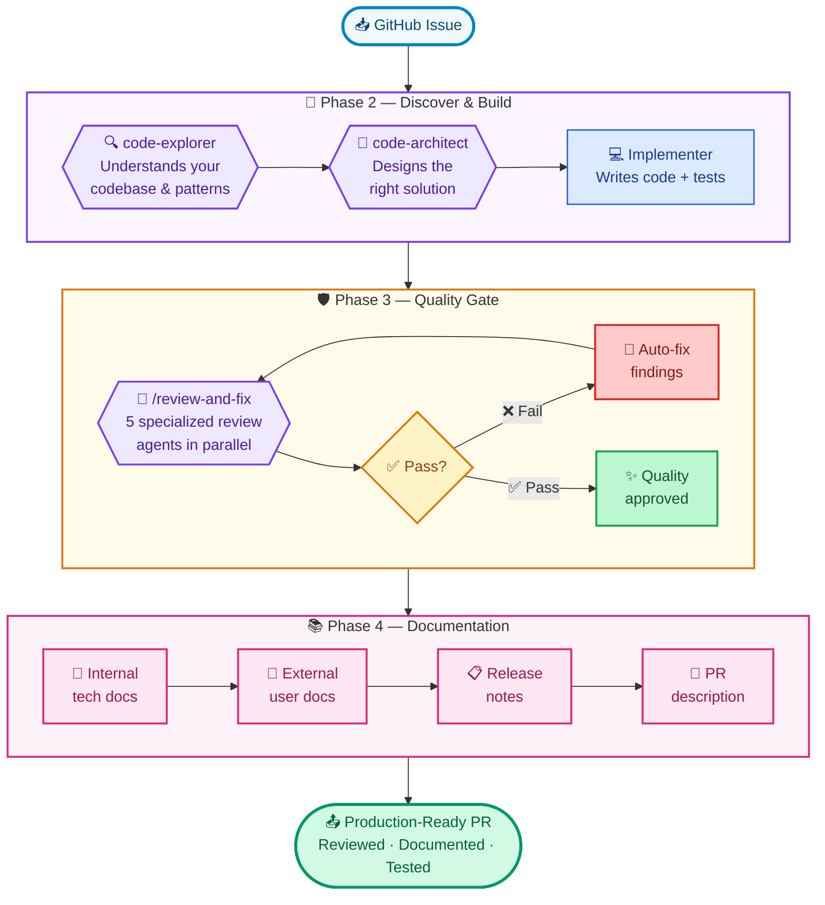
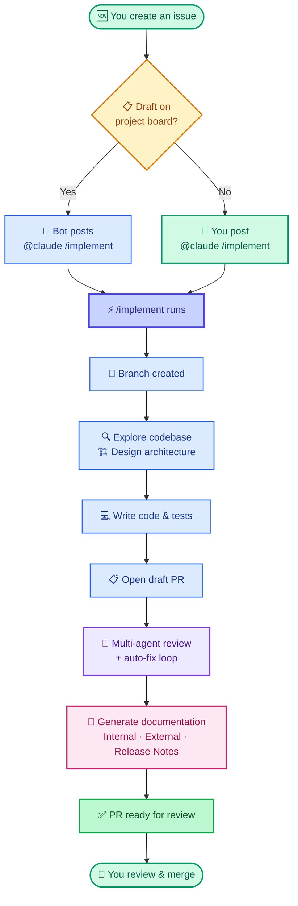
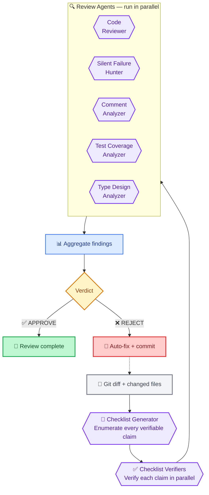
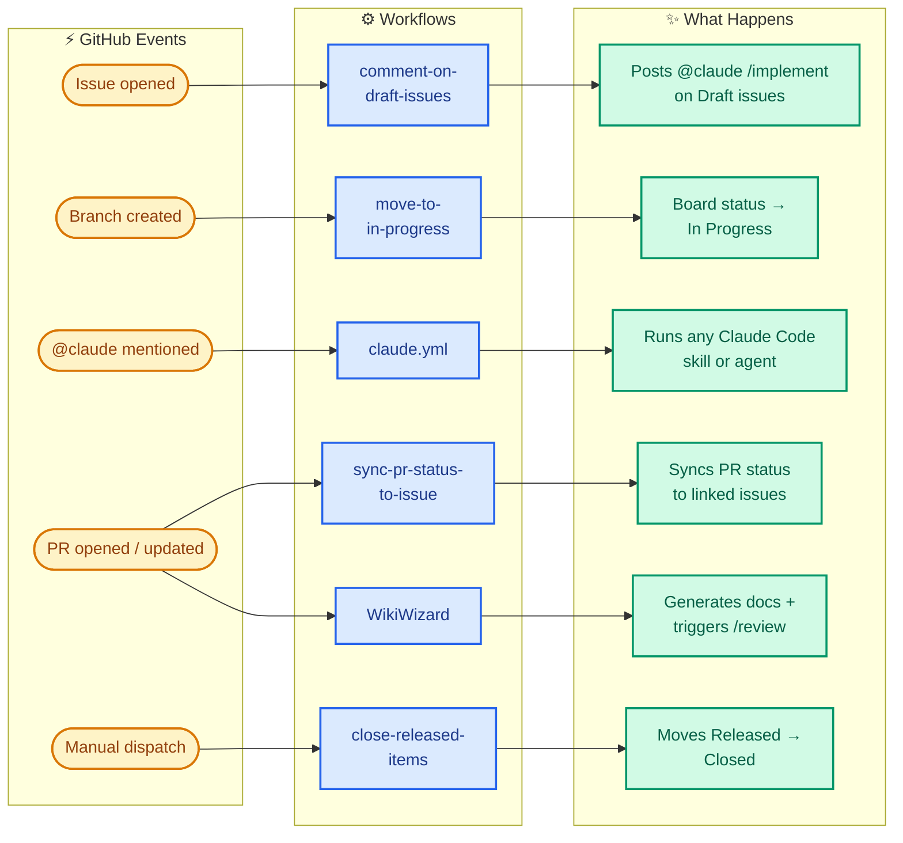

# ⚡ devflow-autopilot

**Turn GitHub issues into reviewed, documented pull requests — automatically.**

devflow-autopilot is a template that wires Claude Code into your GitHub workflow. Drop an issue into your project board, and the automation handles the rest: branch creation, implementation, multi-agent code review, documentation, and status tracking.

---

## 🎬 See It In Action

**[▶ Watch the full walkthrough on YouTube](https://www.youtube.com/watch?v=Uyls8rcviBg)**

---

## ⚡ The `/implement` Pipeline

From a GitHub issue to a production-ready pull request — four phases, multiple AI agents, zero manual coding:

---

## 🔄 What happens when you create an issue

You review the PR. Merge when ready. That's the workflow.

---

## 🚀 Quick Start

1. **Use this template** > Create a new repository
2. Install the [Radman AI](https://github.com/apps/radman-ai) GitHub App on your repo
3. Edit `.github/project-config.yml` with your project number and branch
4. Add secrets: `CLAUDE_CODE_OAUTH_TOKEN`, `RADMAN_AI_PRIVATE_KEY`, `PROJECT_PAT` ([setup guide](#-authentication))
5. Create a [GitHub Projects (v2)](https://docs.github.com/en/issues/planning-and-tracking-with-projects) board with statuses: Draft, In Progress, AI PR Drafted, Released, Closed
6. Fill in `CLAUDE.md` with your project's conventions

Create an issue. Watch it become a PR.

---

## 🛠️ Skills

Skills are slash commands you can run from issues, PRs, or the CLI.

### Development

| Skill | What it does |
|-------|-------------|
| `/implement` | Full lifecycle: issue → branch → implemented PR with tests |
| `/review` | Four-phase code review with verification checklist and APPROVE/REJECT verdict |
| `/review-and-fix` | Runs /review, fixes findings, re-reviews — up to 4 iterations |
| `/create-issue` | Turns a rough idea into a structured GitHub issue |
| `/pr-description` | Generates PR descriptions from branch diff, preserves human edits |

### 📘 Documentation

Two types of documentation are managed automatically:

- **Internal docs** (`docs/internal/`) — Technical documentation for developers and AI coding agents. These serve as context for future Claude Code sessions, making each subsequent implementation more informed.
- **External docs** (`docs/external/`) — Customer-facing documentation. Stripped of implementation details, written for end users.

| Skill | What it does |
|-------|-------------|
| `/docs` | Updates internal docs, external docs, and release notes in one pass |
| `/docs-verify` | Checks if documentation for a specific topic is accurate and current |
| `/docs-sync-internal` | Syncs internal technical docs to match code changes on the branch |
| `/docs-sync-external` | Aligns customer-facing docs with internal docs |
| `/docs-bootstrap-internal` | Generates internal technical docs from scratch for undocumented codebases |
| `/docs-bootstrap-external` | Creates external user-facing docs from existing internal docs |
| `/docs-release-notes` | Writes release note entries for customer-visible changes |

---

## 🤖 Agents

Specialized reviewers that run in parallel during `/review`.

| Agent | Focus area |
|-------|-----------|
| 📝 checklist-generator | Enumerates every verifiable claim in a diff |
| ✅ checklist-verifier | Checks each claim against actual source code |
| 📌 github-issue-creator | Structures rough requirements into detailed issues |

`/review` runs a multi-agent pipeline. `/review-and-fix` wraps it with an auto-fix loop (up to 4 iterations):

---

## ⚙️ Workflows

| Workflow | Trigger | What it does |
|----------|---------|-------------|
| claude.yml | `@claude` mention | Runs Claude Code with full skill/agent access |
| WikiWizard.yml | PR opened or updated | Generates internal docs, external docs, and release notes on the PR branch |
| comment-on-draft-issues.yml | Issue created | Auto-triggers `/implement` on Draft issues |
| move-to-in-progress.yml | Branch created | Updates issue status in project board |
| sync-pr-status-to-issue.yml | PR state change | Keeps linked issues in sync with PR status |
| close-released-items.yml | Manual | Moves "Released" items to "Closed" |

### Project Board Statuses

Issues flow through these statuses automatically. Each arrow shows the workflow that handles the transition:

```mermaid
flowchart LR
    A(["📋 Draft"]):::draft
    B(["🔨 In Progress"]):::progress
    C(["🤖 AI PR Drafted"]):::pr
    D(["🚀 Released"]):::released
    E(["✅ Closed"]):::closed

    A -- "move-to-in-progress.yml<br/>Branch created" --> B
    B -- "sync-pr-status-to-issue.yml<br/>PR opened" --> C
    C -- "Merged + tagged" --> D
    D -- "close-released-items.yml<br/>Manual dispatch" --> E

    classDef draft fill:#fef3c7,stroke:#d97706,stroke-width:2px,color:#92400e
    classDef progress fill:#dbeafe,stroke:#2563eb,stroke-width:2px,color:#1e3a8a
    classDef pr fill:#ede9fe,stroke:#7c3aed,stroke-width:2px,color:#4c1d95
    classDef released fill:#d1fae5,stroke:#059669,stroke-width:2px,color:#065f46
    classDef closed fill:#f3f4f6,stroke:#6b7280,stroke-width:2px,color:#374151
```

### Workflow Trigger Map

Six workflows react to GitHub events and keep everything moving:

---

## 📦 Configuration

Everything is in `.github/project-config.yml`. Key fields:

| Field | What it controls | Default |
|-------|-----------------|---------|
| `project_number` | Your GitHub Project board number | `"1"` |
| `app_id` | GitHub App ID for project automation | `"3102164"` (Radman AI) |
| `base_branch` | Default PR target | `"main"` |
| `claude_model` | Model for AI workflows | `"claude-opus-4-6"` |
| `statuses.*` | Project board status names | Draft, In Progress, etc. |
| `docs.internal` / `docs.external` | Documentation paths | `docs/internal/`, `docs/external/` |
| `bot_login` | Bot account for AI-authored PRs | `"radman-ai"` |
| `claude.allowed_bots` | Bots that can trigger Claude | `"radman-ai"` |
| `wikiwizard.*` | Doc generation settings | label, release notes path, allowed bots |
| `workflows.*` | Toggle each workflow on/off | all `true` |

---

## 🔐 Authentication

### Required Secrets

| Secret | Purpose |
|--------|---------|
| `CLAUDE_CODE_OAUTH_TOKEN` | Claude Code API access ([docs](https://docs.anthropic.com/en/docs/claude-code/github-actions)) |
| `RADMAN_AI_PRIVATE_KEY` | GitHub App private key |
| `PROJECT_PAT` | Classic PAT with `repo` + `project` scopes — used for all ProjectV2 operations |

The GitHub App ID is configured in `.github/project-config.yml` (`app_id` field, defaults to `3102164` for Radman AI).

> **Why a PAT?** GitHub App installation tokens cannot access user-owned ProjectsV2 (there is no "Projects" permission for personal accounts). The `PROJECT_PAT` works around this limitation. If you move to an organization, you can switch back to the app token by granting "Organization permissions → Projects: Read & Write" on your GitHub App.

### GitHub App Setup

**Option 1: Install Radman AI (recommended)**

1. Install [Radman AI](https://github.com/apps/radman-ai) on your repository
2. Add the private key as a repo secret (`RADMAN_AI_PRIVATE_KEY`)

**Option 2: Create your own GitHub App**

1. Settings > Developer settings > GitHub Apps > New
2. Permissions: issues (write), pull_requests (write), projects (read/write), contents (read)
3. Install on your repo
4. Add the private key as a repo secret
5. Set `app_id` in `.github/project-config.yml` to your app's ID
6. Update `bot_login` and `allowed_bots` in `.github/project-config.yml` to match your app's slug

To use different secret names, find-and-replace `RADMAN_AI_` in the workflow files.

### Classic PAT for Project Board Access

GitHub App tokens **cannot access user-owned ProjectsV2** — this is a platform limitation. All project board workflows use the `PROJECT_PAT` secret instead.

1. Go to [Settings → Developer settings → Personal access tokens → Tokens (classic)](https://github.com/settings/tokens)
2. Create a token with scopes: **`repo`** and **`project`**
3. Add it as a repository secret named **`PROJECT_PAT`**
4. Rotate before expiry

If you move to an **organization**, you can switch back to the GitHub App token by adding "Organization permissions → Projects: Read & Write" to your app, then removing the `PROJECT_PAT` references from the workflow files.

---

## 🧩 Customization

- **Toggle workflows** on/off in `project-config.yml`
- **Add your own skills** — create a directory under `.claude/skills/` with a `SKILL.md`
- **Add your own agents** — drop an `.md` file in `.claude/agents/`
- **Add language plugins** — edit `.claude/settings.json`
- **Define conventions** — fill in `CLAUDE.md` so Claude follows your project's standards
- **Configure tests** — document test/lint commands in `CLAUDE.md` so `/review-and-fix` can run them

---

## 📋 Requirements

- A GitHub repository (public or private)
- [GitHub Projects (v2)](https://docs.github.com/en/issues/planning-and-tracking-with-projects) board with a Status field
- Claude Code OAuth token
- A GitHub App (Radman AI or your own) for issue/PR automation
- A Classic PAT with `repo` + `project` scopes for project board access

No GitHub Projects? Disable the board-dependent workflows and use Claude Code skills directly from issues and PRs.

---

## License

MIT
