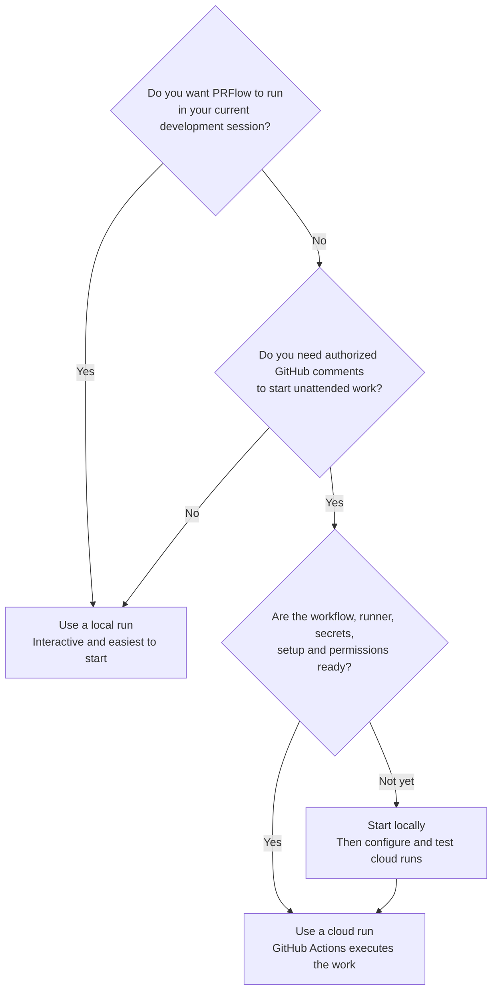

Choose local or cloud execution based on where your team wants PRFlow to run. Both modes follow a similar lifecycle, but their credentials, permission boundaries and interaction models differ.

| **Run Type** | **Execution Environment** | **Best For** |
| --- | --- | --- |
| [Local runs](/docs/runs/local/index) | Your Claude Code, GitHub Copilot CLI or Codex CLI session. | First use, interactive decisions and access to an existing development environment. |
| [Cloud runs](/docs/runs/cloud/index) | GitHub Actions after an authorized comment. | Headless, comment-driven implementation and review with repository-managed credentials. |

Local runs inherit tools, authentication and permission prompts from your client session. They need no GitHub Actions workflows or cloud secret.

Cloud runs use committed workflows, explicit GitHub permissions, repository secrets and a declared setup process. Fresh cloud installations support issue-driven implementation and collaborator-triggered review. They require more maintenance than the local path.

Begin locally. Add cloud automation after the workflow, verification commands and permission scopes are understood.

## Related Documentation

- [Client Command Syntax](/docs/runs/local/client-commands)
- [Local Permissions](/docs/runs/local/permissions)
- [Cloud Setup](/docs/runs/cloud/setup)
